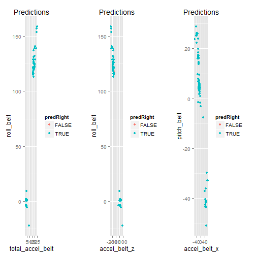

# Exercise prediction algorithm 
========================================================


## Synopsis

In this document I will try to train an algorithm to distinguish between different exercises types/conditions. I will use a cca. 19k sample to train my algorithm with and then use it on a 20 sample test set. Since the sets have a large number of variables I decided to use a boosting with trees method. The test sample size is small so even if the results of the algorithm turn out to bee good it can be attributed to the small sample size. This will be a basic prediction algorithm and to be sure to get more favourable results one should do a more thourogh training then done in this assignment. That being said I believe it is good enough for what it is supposed to do. 

## Data Processing 

Here first, I am loading the training and the test dataset.


```r
library(caret)
library(e1071)
library(randomForest)
library(gbm)
library(plyr)
library(ggplot2)
training <- read.csv("pml-training.csv")
testing <- read.csv("pml-testing.csv")
```

Then I look at the training dataset and see that a lot of columns are practically empty so I remove those ones to get a tidy dataset. Doing the same as well for the test one.


```r
head(training)  #hidden results because 160 columns
training <- training[, c(2, 8, 9, 10, 11, 37, 38, 39, 40, 41, 42, 43, 44, 45, 
    46, 47, 48, 49, 60, 61, 62, 63, 64, 65, 66, 67, 68, 84, 85, 86, 102, 113, 
    114, 115, 116, 117, 118, 119, 120, 121, 122, 123, 124, 140, 151, 152, 153, 
    154, 155, 156, 157, 158, 159, 160)]
testing <- testing[, c(2, 8, 9, 10, 11, 37, 38, 39, 40, 41, 42, 43, 44, 45, 
    46, 47, 48, 49, 60, 61, 62, 63, 64, 65, 66, 67, 68, 84, 85, 86, 102, 113, 
    114, 115, 116, 117, 118, 119, 120, 121, 122, 123, 124, 140, 151, 152, 153, 
    154, 155, 156, 157, 158, 159, 160)]
```

Then it is time to fit the model. I used a smaller sample of the training set because it would otherwise crash my pc.


```r
training1 <- training[sample(nrow(training), 5000, replace = F), ]
inTrain <- createDataPartition(y = training1$classe, p = 1, list = FALSE)
training1 <- training1[inTrain, ]
```

Also since there were still a lot of variables left I tried to find some correlated predictors. And when I removed the results that contained the individuals I got one nice hit.


```r
M <- abs(cor(training1[, -c(1, 54)]))
diag(M) <- 0
which(M > 0.95, arr.ind = T)
```

```
##                  row col
## total_accel_belt   4   1
## accel_belt_z      10   1
## accel_belt_x       8   2
## roll_belt          1   4
## accel_belt_z      10   4
## pitch_belt         2   8
## roll_belt          1  10
## total_accel_belt   4  10
```

```r
qplot(training$roll_belt, training$gyros_belt_z, col = classe, data = training)
```

 

But in the end I decided on using a boosting model because of the large number of variables. I did a 25-fold cross-validation and got an accuracy of 0.886. If I used a bigger amount of training data and more cross-validation I would get a better accuracy as well.


```r
set.seed(33333)
modFit <- train(classe ~ ., preProcess = c("center", "scale"), method = "gbm", 
    data = training1, verbose = FALSE, trControl = trainControl(method = "cv", 
        25))
print(modFit)
```

```
## Stochastic Gradient Boosting 
## 
## 4995 samples
##   53 predictor
##    5 classes: 'A', 'B', 'C', 'D', 'E' 
## 
## Pre-processing: centered, scaled 
## Resampling: Cross-Validated (25 fold) 
## 
## Summary of sample sizes: 4796, 4795, 4795, 4796, 4795, 4796, ... 
## 
## Resampling results across tuning parameters:
## 
##   interaction.depth  n.trees  Accuracy  Kappa  Accuracy SD  Kappa SD
##   1                   50      0.7       0.7    0.03         0.04    
##   1                  100      0.8       0.8    0.04         0.05    
##   1                  150      0.9       0.8    0.03         0.04    
##   2                   50      0.9       0.8    0.03         0.04    
##   2                  100      0.9       0.9    0.03         0.03    
##   2                  150      0.9       0.9    0.02         0.03    
##   3                   50      0.9       0.9    0.03         0.04    
##   3                  100      0.9       0.9    0.02         0.03    
##   3                  150      0.9       0.9    0.02         0.02    
## 
## Tuning parameter 'shrinkage' was held constant at a value of 0.1
## Accuracy was used to select the optimal model using  the largest value.
## The final values used for the model were n.trees = 150,
##  interaction.depth = 3 and shrinkage = 0.1.
```

And I used also a small subset of the training data to see how well does my prediction algorithm work. Interestingly it doesnt seem that the errors came from measurments that are outliers in the 5 most correlated variables.


```r
library(gridExtra)
training_val <- training[sample(nrow(training),100,replace=F),]
inTrain_val <- createDataPartition(y=training_val$classe,p=1,list=FALSE)
training_val <- training_val[inTrain_val,]
pred<- predict(modFit,training_val)
training_val$predRight <- pred==training_val$classe
table(pred,training_val$classe)
```

```
##     
## pred  A  B  C  D  E
##    A 28  0  0  0  0
##    B  1 16  0  0  0
##    C  0  0 15  0  0
##    D  0  0  0 16  0
##    E  0  0  0  0 19
```

```r
plot1 <- qplot(total_accel_belt,roll_belt,colour=predRight,data=training_val,main="Predictions")
plot2 <- qplot(accel_belt_z,roll_belt,colour=predRight,data=training_val,main="Predictions")
plot3 <- qplot(accel_belt_x,pitch_belt,colour=predRight,data=training_val,main="Predictions")
grid.arrange(plot1, plot2, plot3,  ncol=3)
```

 

Finally, I used my model on the real test set and tried to guess the exercises


```r
pred_test<- predict(modFit,testing)
table(pred_test,testing[,54])
```

```
##          
## pred_test 1 2 3 4 5 6 7 8 9 10 11 12 13 14 15 16 17 18 19 20
##         A 0 1 0 1 1 0 0 0 1  1  0  0  0  1  0  0  1  0  0  0
##         B 1 0 1 0 0 0 0 1 0  0  1  0  1  0  0  0  0  1  1  1
##         C 0 0 0 0 0 0 0 0 0  0  0  1  0  0  0  0  0  0  0  0
##         D 0 0 0 0 0 0 1 0 0  0  0  0  0  0  0  0  0  0  0  0
##         E 0 0 0 0 0 1 0 0 0  0  0  0  0  0  1  1  0  0  0  0
```

